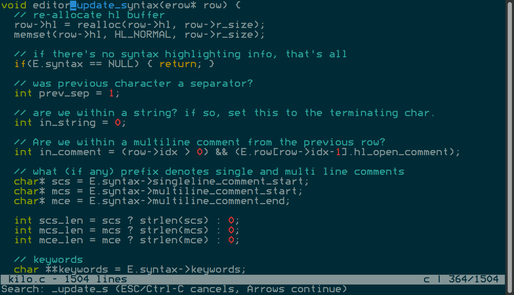

# Build your own text editor

The result of me working through the [build your own text
editor](http://viewsourcecode.org/snaptoken/kilo/) tutorial. The original
tutorial's source code is at
[https://github.com/snaptoken/kilo-tutorial](https://github.com/snaptoken/kilo-tutorial).

In addition to the original functionality, this implementation has a couple of
extra features I coded when "dog fooding" it to write itself:

* Auto indent
* Auto truncation of white-space only lines

## Screenshot

